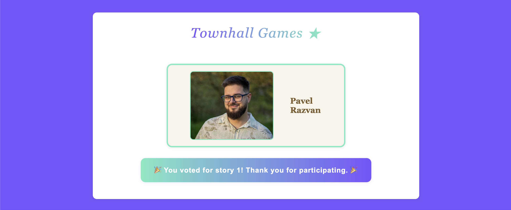
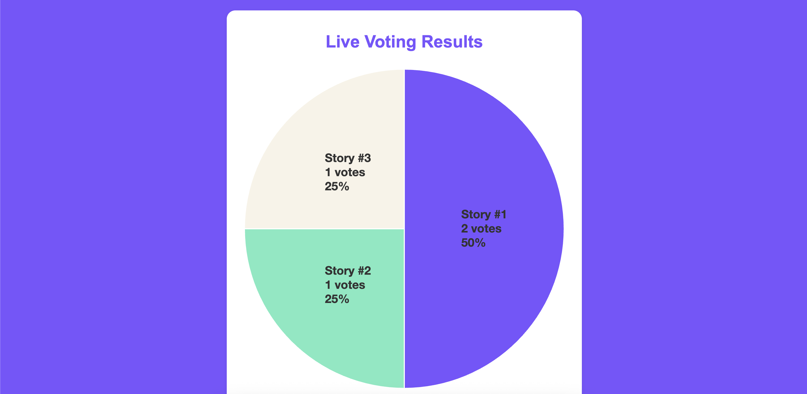

# Townhall Games: 2 Truths and 1 Lie 🎲

A web application for hosting and playing the classic icebreaker game "2 Truths and 1 Lie" during townhall meetings or team events. Built with Node.js, Express, and static HTML/CSS/JS, it provides a simple interface for both participants and administrators.

---

## Game Flow & Features 🚦

**Objective:**
- A candidate shares three statements about themselves: two are true, one is a lie.
- The audience tries to guess which statement is the lie by voting.

**How It Works:**
1. **Admin uploads candidate info:**
   - On the [admin page](http://localhost:1992/admin), upload a photo and enter the candidate's name.
   - Click "Publish" to make the candidate visible to all participants.
2. <span style="color: red; font-weight: bold;">Candidate must tell their three stories verbally to the audience.</span>
   - <span style="color: red; font-weight: bold;">Stories are not shown on the website; they must be spoken aloud.</span>
3. **Audience votes:**
   - On the [main page](http://localhost:1992/), audience members see the candidate's photo and name.
   - Each user can vote for which story they think is the lie by clicking one of the three vote buttons. (One vote per browser.)
   - After voting, users receive instant feedback and confetti animation.
4. **Live results:**
   - The [results page](http://localhost:1992/results) displays a live-updating chart (pie or bar) showing the current vote distribution for all three stories. Results update automatically as votes are cast.
5. **Admin can reset for a new candidate:**
   - After publishing, a "New one" button appears to refresh and add another candidate.

---

## Demo Video 🎥

See the app in action:
[Watch the demo video on Google Drive](https://drive.google.com/file/d/1b5Xc4Hccvv8O5JVV1XWZR_4Z4NXWHCMH/view)

---

## Pages & URLs 🌐

- **Main Page:** [http://localhost:1992/](http://localhost:1992/)  
  Displays the current candidate's photo and name. Audience can vote for the lie.  
  
  

- **Admin Page:** [http://localhost:1992/admin](http://localhost:1992/admin)  
  Admin uploads candidate info and publishes to the main page.  
  

- **Results Page:** [http://localhost:1992/results](http://localhost:1992/results) or [http://localhost:1992/results](http://localhost:1992/results)  
  Shows live voting results for the three stories, with an automatically updating chart.  
  

---

## Page Roles & Usage 🧑‍💻

- **Main Page:**
  - This page is intended for all voters. Share this link with participants so they can view the candidate and cast their vote.

- **Admin Page:**
  - This page is meant to be opened and used privately by the Townhall speaker or moderator. It is not for general participants.

- **Results Page:**
  - This page is designed to be displayed in a shared window (e.g., on Microsoft Teams, Zoom, or a projector) so everyone can see live voting results together.

---

## How to Run Locally 🏠

1. **Install dependencies:**
   ```bash
   npm install
   ```
2. **Start the server:**
   ```bash
   node server.js
   ```
3. **Access the app:**
   - Main page: [http://localhost:1992/](http://localhost:1992/)
   - Admin page: [http://localhost:1992/admin](http://localhost:1992/admin)
   - Results page: [http://localhost:1992/results](http://localhost:1992/results)

---

## How to Run in Production 🚀

### Using Docker Compose

1. **Start services:**
   ```bash
   docker-compose up --build
   ```
   - The app will be available at [http://localhost:1992](http://localhost:1992)

---

## Project Structure 🗂️

```
admin.html            # Admin interface
index.html            # Main user interface
results.html          # Live voting results page
server.js             # Express server
package.json          # Node.js dependencies and scripts
Dockerfile            # For containerization
docker-compose.yml    # For running with Docker Compose
.gitignore            # Common ignores
README.md             # This file

css/
  app.css             # Shared styles
  admin.css           # Admin-specific styles
  results.css         # Results page styles

js/
  app.js              # Main page voting logic
  admin.js            # Admin page logic
  results.js          # Results page chart logic

db/
  publish.json        # Stores published candidate info
  votes.json          # Stores vote counts
  lie.json            # Stores which story is the lie

images/
  vote.png            # Screenshot of main page
  vote2.png           # Screenshot of voting UI
  admin.png           # Screenshot of admin page
  results.png         # Screenshot of results page
```

---

## Technical Details 🛠️

- **Express** serves static files and provides API endpoints for voting, publishing, and results.
- **Voting API:** `/api/vote` accepts POST requests with the selected story number and updates votes instantly.
- **Live Results:** `/api/results` returns current vote counts; the results page polls this endpoint and displays a live chart (using JS, e.g., Chart.js or custom SVG).
- **Persistent Storage:** Candidate info and votes are stored in JSON files in the `db/` folder.
- **Responsive design** for desktop and mobile.
- **No database required.**

---

## Database & Storage 🗄️

All persistent data is stored as JSON files in the `db/` folder:
- `publish.json`: Stores the current candidate's photo, name, and date.
- `votes.json`: Stores the vote counts for each story (keys: 1, 2, 3).
- `lie.json`: Stores which story is the lie (key: `lie`).

No external database is required; all data is file-based and easy to back up or reset.

---

## How to Play: Step-by-Step 🎤

1. **Admin uploads candidate:**
   - Go to the [admin page](http://localhost:1992/admin).
   - Upload a photo and enter the candidate's name.
   - Click "Publish". The candidate's info is now visible to all participants.
2. **Candidate tells their story:**
   - The candidate shares three statements (two truths, one lie) live or via chat.
3. **Audience votes:**
   - On the [main page](http://localhost:1992/), audience members see the candidate's photo and name.
   - Click one of the three vote buttons to guess which story is the lie. (One vote per browser.)
   - After voting, instant feedback and confetti animation are shown.
4. **View live results:**
   - Go to the [results page](http://localhost:1992/results) to see a live-updating chart of votes for each story.
5. **Admin can reset for a new candidate:**
   - After publishing, a "New one" button appears to refresh and add another candidate.

---

## Troubleshooting 🧑‍💻

- **Voting errors (e.g., Cannot POST /api/vote):** Ensure the server is running and the backend has the `/api/vote` route implemented.
- **Images not displaying in README:** Ensure `images/vote.png`, `images/admin.png`, and `images/results.png` are present and committed.
- **Port conflicts:** The app runs on port `1992` by default. Change in `server.js` if needed.
- **API errors:** Ensure the server is running and accessible at the correct port.

---

## Automatic Vote Reset 🗓️

Whenever the admin accesses the /admin page on a day different from the current published townhall (candidate), all votes are automatically reset. This ensures that each new session starts with a clean slate and previous votes do not affect the new candidate's results.

---

## License 📄

MIT License. Free to use and modify for your own events.

---

Enjoy your townhall game of 2 Truths and 1 Lie! 🎉
