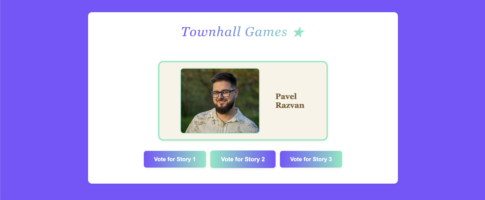
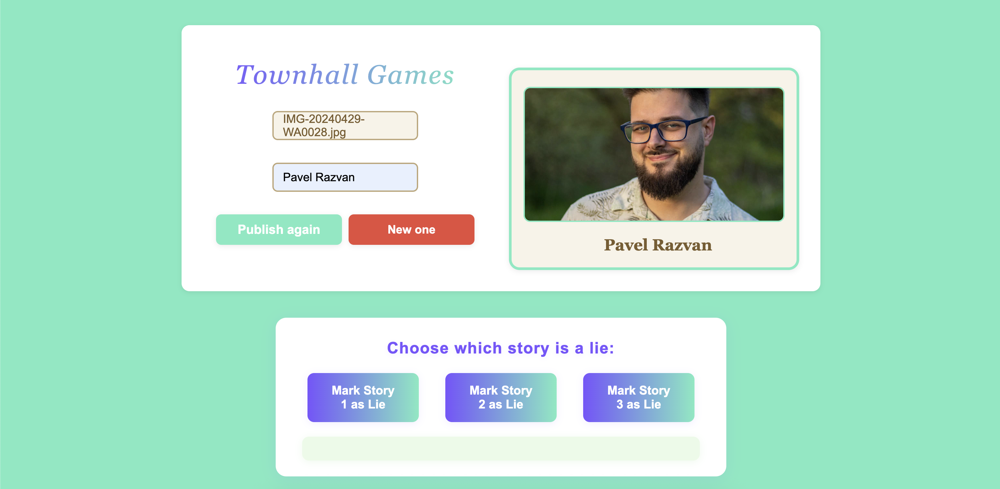

# Townhall Games: 2 Truths and 1 Lie 🎲

> **Note:** This entire project was written by the GitHub Copilot agent. The developer did not touch the code directly, only provided prompts and accepted all changes generated by the agent.

A web application for hosting and playing the classic icebreaker game "2 Truths and 1 Lie" during townhall meetings or team events. Built with Node.js, Express, and static HTML/CSS/JS, it provides a simple interface for both participants and administrators.

---

## Game Overview: 2 Truths and 1 Lie 🤔

**Objective:**
- A candidate shares three statements about themselves: two are true, one is a lie.
- The audience tries to guess which statement is the lie.

**How It Works:**
- The admin uploads a candidate's photo and name.
- The candidate tells their story (the three statements) live or via another channel.
- The audience views the candidate's photo and name on the main page and participates in guessing.

---

## Pages & URLs 🌐

- **Main Page:** [http://localhost:1992/](http://localhost:1992/)  
  Displays the current candidate's photo and name.  
  Audience can view and participate in the game.  
  

- **Admin Page:** [http://localhost:1992/admin](http://localhost:1992/admin)  
  Admin can upload a candidate's photo and enter their name.  
  After publishing, the candidate's info is shown on the main page.  
  

---

## How to Run Locally 🏠

1. **Install dependencies:**
   ```bash
   npm install
   ```
2. **Start the server:**
   ```bash
   node server.js
   ```
3. **Access the app:**
   - Main page: [http://localhost:1992/](http://localhost:1992/)
   - Admin page: [http://localhost:1992/admin](http://localhost:1992/admin)

---

## How to Run in Production 🚀

### Using Docker Compose

1. **Start services:**
   ```bash
   docker-compose up --build
   ```
   - The app will be available at [http://localhost:1992](http://localhost:1992)

---

## Project Structure 🗂️

```
├── admin.html         # Admin interface
├── index.html         # Main user interface
├── server.js          # Express server
├── publish.json       # Stores published candidate info
├── css/
│   ├── app.css        # Shared styles
│   └── admin.css      # Admin-specific styles
├── js/
│   ├── app.js         # Shared JS logic
│   └── admin.js       # Admin-specific JS
├── images/
│   ├── vote.png       # Screenshot of main page
│   └── admin.png      # Screenshot of admin page
├── Dockerfile         # For containerization
├── docker-compose.yml # For running with Docker Compose
├── .gitignore         # Common ignores
└── README.md          # This file
```

---

## Technical Details 🛠️

- **Express** serves static files and provides a simple API for publishing candidate info.
- **Persistent Storage:** Candidate info is saved in `publish.json` and is available to all users.
- **No database required.**
- **Responsive design** for desktop and mobile.
- **Favicon:** Custom star icon for branding ⭐️.

---

## How to Play: Step-by-Step 🎤

1. **Admin uploads candidate:**
   - Go to the [admin page](http://localhost:1992/admin).
   - Upload a photo and enter the candidate's name.
   - Click "Publish". The candidate's info is now visible to all participants.
2. **Candidate tells their story:**
   - The candidate shares three statements (two truths, one lie) live or via chat.
3. **Audience participates:**
   - Audience views the candidate's photo and name on the [main page](http://localhost:1992/).
   - Audience guesses which statement is the lie (interaction can be managed live or via another tool).
4. **Admin can reset for a new candidate:**
   - After publishing, a "New one" button appears to refresh and add another candidate.

---

## Troubleshooting 🧑‍💻

- **Images not displaying in README:** Ensure `images/vote.png` and `images/admin.png` are present and committed.
- **Port conflicts:** The app runs on port `1992` by default. Change in `server.js` if needed.
- **API errors:** Ensure the server is running and accessible at the correct port.

---

## License 📄

MIT License. Free to use and modify for your own events.

---

## TODO Next 📝

- Add voting system for audience to select which statement is the lie.
- Live display of voting results as votes are cast.
- Admin ability to reveal the correct answer when voting is complete.
- Nice animation for winners and reveal moment.

---

Enjoy your townhall game of 2 Truths and 1 Lie! 🎉
